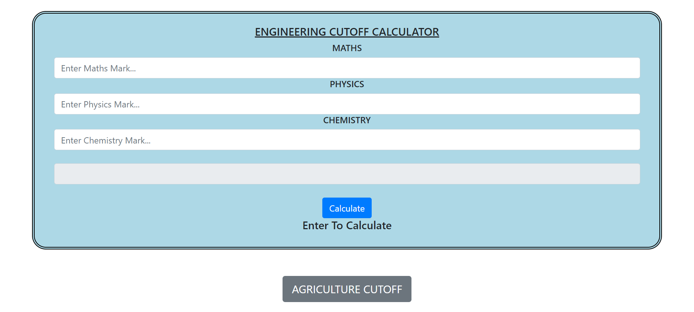
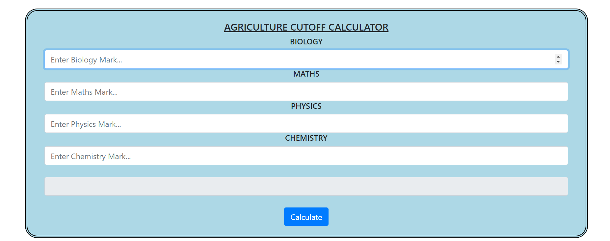

# **Engineering and Agriculture Cutoff Calculator**
This is a web-based cutoff calculator designed for both engineering and agriculture aspirants. It allows users to calculate their admission cutoff scores based on provided input parameters. The calculator utilizes HTML, CSS, and JavaScript to offer an interactive and user-friendly interface.

## **Features**

- **Engineering Cutoff Calculation:** Users can input their scores in mathematics, physics, and chemistry to calculate their engineering admission cutoff. 
- **Agriculture Cutoff Calculation:** For agriculture aspirants, input fields for biology, chemistry, and physics are available to compute the cutoff. 
- **Responsive Design:** The calculator is designed to be **responsive**, ensuring a seamless user experience across various devices and screen sizes. 
- **Error Handling:** The application provides **error handling** to ensure that users input valid scores within the specified range.

## **Technologies Used**

 :art: **HTML:** Structuring the web page elements. 
 :art: **CSS:** Styling the user interface for an appealing look. 
 :art: **JavaScript:** Implementing the calculation logic and interactivity. 

## **How to Use**

1. **Open the websiter using URL:** https://vigneshwaranbalamurugan.github.io/cutoff_calculator/.
2. **Input Scores:** Fill in the required fields with your scores.
3. **Calculate Cutoff:** Click the "Calculate" button to obtain your cutoff score.

## **Screenshots**

   
